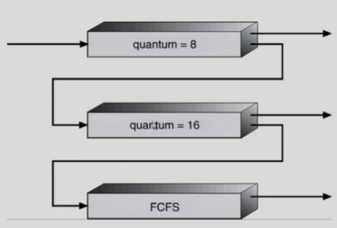

## 스케줄러

### 스케줄러이란?
프로세스는 생성되고 난 뒤 여러 상태를 거치게 됩니다. CPU는 한번에 한개의 프로세스만을 작업할수 있는데, 운영체제의 CPU 스케줄러는 Ready 상태의 프로세스 중에서 어떤 프로세스에게 CPU를 할당할지 결정합니다. 이를 CPU스케줄링이라 합니다. 

또한 이렇게 선택된 프로세스에게 CPU제어권을 넘기는 과정을 Context Switch라 하고 Dispatcher가 담당하여 처리하게 됩니다.

 

### Cpu스케줄링 발생 상황
1. Running 상태에 있던 프로세스가 I/O 요청 등에 의해 Wait 상태가 되는 경우
2. Running 상태에 있던 프로세스가 타이머 인터럽트 발생에 의해 Ready 상태로 되는 경우
3. I/O 요청으로 Wait 상태에 있던 프로세스의 I/O 작업이 완료되어 인터럽트가 발생하고, 그 결과 이 프로세스의 상태가 Ready 상태로 바뀌는 경우
4. CPU에서 실행 상태에 있는 프로세스가 종료되는 경우

 

### 스케줄러 방식

cpu에서 작업중인 프로세스와 Ready Queue에서 ready상태인 프로세스 여러개가 있을때 ready된 어느 프로세스를 선택할지를 고려하는 것이 스케줄러의 역할이다.

ready queue는 연결리스트 또는 이진트리로 만들수 있는데, 두가지 방식이 존재한다.

1. FIFO Queue : First In First Out. 즉 먼저 들어온 프로세스를 먼저 cpu를 할당하는 방법이다. 하지만 우선순위가 급한 프로세스를 먼저 처리하는 것이 합리적이지 않을까?
2. Priority Queue : 프로세스의 우선순위를 정해 우선순위가 높은 프로세스를 먼저 cpu를 할당하는 방법이다. 

이떄 고려해야할 사항은 우선순위를 결정하는 방법이다. 그 전에 스케줄러의 종류에 대해 먼저 알아보자!

### 선점형 vs 비선점형

CPU스케줄링의 종류는 선점형과 비선점형 두가지로 나뉜다.

선점형 
- 하나의 프로세스가 CPU를 차지하고 있을 때, 우선순위가 높은 다른 프로세스가 현재 프로세스를 중단시키고 CPU를 점유하는 스케줄링 방식
- 비교적 응답이 빠르다는 장점이 있지만, 높은 우선순위 프로세스들이 계속 들어오는 경우 오버헤드가 발생하고, 처리시간을 예측하기 힘들다

 

비선점형
- 한 프로세스가 CPU를 할당받으면 작업 종료 후 CPU 반환 시까지 다른 프로세스는 PCU 점유가 불가능한 스케줄링 방식
- 모든 프로세스에 대한 요구를 공정하게 처리할 수 있지만, 짧은 작업을 수행하는 프로세스가 긴 작업 종료 시까지 대기해야할 수도 있다. (콘베이 현상)
- 처리시간 편차가 적은 특정 프로세스 환경에 용이하다.

### 바선점형 스케줄링 종류

 

**선입 선출 스케줄링(FCFS : First-Come-First-Served)**

FIFO라고도 불리며, 먼저 온 프로세스에게 cpu를 먼저 주는 방식이다.

문제점 )

Convoy효과 : 처리 시간이 긴 프로세스가 먼저 도착하면 뒤의 프로세스의 작업시간이 짧더라도 대기시간이 길어진다.

ex) A : 10초 , B : 1초라면 평균대기시간은 5초인데, B -> A 순서로 하게되면 0.5초로 대기시간이 줄게된다.

 

**최단 작업 우선 스케줄링(SJF : Shortest-Job-First)**

CPU Burst시간이 짧은 프로세스에게 먼저 CPU를 할당하는 방식이다.

cpu를 잡고나면 작업중인 프로세스보다 짧은 burst 시간을 가진 프로세스가 들어와도 cpu를 주지 않는다.

> CPU Burst : CPU를 통해 작업을 실행하는 단계

 

**우선순위 스케줄링(Priority Scheduling)**

우선 순위가 가장 높은 프로세스에게 CPU를 할당한다. SJF도 일종의 우선순위 스케줄링이다.

### 선점형 스케줄링 종류
 

**SRT 스케줄링(Shortest-Remaining-Time)**

SJF스케줄링을 선점형으로 구현한 기법으로 SRTF(Shortest-Remaining-Time-First)라고도 부른다.

먼저 CPU를 잡더라도 더 짧은 burst시간의 프로세스가 들어오면 cpu를 뺐기게된다.

문제점 )
Starvation(기아)
: 짧은 버스트의 프로세스로 인해 긴 버스트의 프로세스가 영원히 cpu를 잡지 못할수도 있다.

CPU Burst시간을 미리 알수 없다.
: 과거 시간을 바탕으로 예측만 가능하기에 작업 처리시간을 사전에 예측할수 없다.

 

**라운드 로빈 스케줄링(RR : Round Robin)**

동일한 크기의 time quantum을 각 프로세스에 할당하여 timer에 항당 시간이 끝나면 timer interrupt에 의해 cpu의 제어권을 운영체제에 빼았기고 Ready Queue의 맨 뒤로 들어가게된다.

>Ready Queue : 레디상태의 프로세스들이 모아져 있음. 스케쥴러는 레디큐에서 어떤 프로세스가 다음에 선택되야 하는지 결정.

 

**멀티 레벨 큐(Multi-Level Queue)**

작업들을 여러종류의 그룹으로 나눠 여러개의 큐를 이용하는 방법이다.

Ready Queue를 우선순위에 따라 여러개로 분할한다. 

그룹화된 작업들은 각각의 Ready Queue에 넣어두고 각 큐의 독자적인 스케줄링 알고리즘으로 CPU를 할당받는다.

- 전면 작업(전위큐) : 빠른 응답을 필요로 하는 작업을 넣는다. 주로 라운드 로빈 스케줄링 기법을 사용한다.(응답 시간이 빨라야하므로)
- 후면 작업(후위 쿠) : 일괄처리 작업들로, 일반적으로 CPU를 오래 사용하는 계산 위주의 작업을 넣는다. 주로 FCFS스케줄링 기법을 사용한다.(long job들은 컨텍스트 스위치가 잦은 것이 더 비효율적이기 때문) 

종류
1. 고정 우선순위 방식
   - 전위 큐에 있는 프로세스에게 우선적으로 cpu가 할당되고, 전위큐가 비어있을때만 후위 큐에 있는 프로세스에게 cpu가 할당
   - 후위큐에 대해 Starvation 가능성이 있다.
  
2. 타임 슬라이스 방식
   - 전위큐에 우선순위를 주지만 조절하여 우선순위를 주는 방법
   - 각 큐에 CPU time을 적절한 비율로 할당한다. 이를 후위큐의 Starvation을 방지할수 있다.
   - ex) 80%는 전위큐, 20%는 후위큐

  

**멀티 레벨 피드백 큐(Multi-Level-Feedback Queue)**

멀티레벨큐와 같은 방식이지만, 프로세스가 다른 큐로 이동이 가능하다. 우선순위의 변화, 즉 재배치가 가능하다는 특징이 있다.
(멀티레벨큐는 한 번 정해진 우선순위의 변화가 없다.)

각 단계별로 시분할을 다르게 하여 첫단계에서 프로세스를 완료하지 못하면 우선순위가 다음 순위로 넘어간다.

하나의 프로세스가 기아 현상을 일으키는 프로세스가 존재한다면 노화 기법을 통해 우선순위가 높은 큐로 이동시키는 방식을 사용하기도 한다.

 

## Q) 프로세스의 스케쥴링 상태에 대해 설명해 주세요.

프로세스는 다음 5가지 상태 중 하나를 가진다.

- New : 프로세스가 생성된 상태이며, 운영체제가 아직 할당되지 않은 자원을 가지고 있다.
- Ready : 프로세스가 실행을 기다리는 상태이며, 운영체제가 필요한 자원을 할당하여 실행 가능한 상태.
- Running : 프로세스가 CPU를 사용하여 실행되는 상태이며, CPU 시간을 할당 받아 작업을 수행한다.
- Blocked : 프로세스가 실행을 중지하고, 특정 이벤트가 발생하기를 기다리는 상태. 이벤트는 주로 입출력(IO) 작업과 같은 외부 요청이다.
- Terminated : 프로세스가 완전히 종료되어 더 이상 실행되지 않는 상태.

## Q) preemptive/non-preemptive 에서 존재할 수 없는 상태가 있을까요?

### preemptive

- 현재 실행중인 프로세스를 중단시키고 다른 프로세스가 CPU를 점유할 수 있도록 하는 방식

### 단점

- 우선 순위가 높은 프로세스를 빠르게 처리할 수 있지만 상황에 따라 잦은 컨텍스트 스위칭으로 오버헤드가 발생할 수 있다.

ex) SRTF,RR,스케줄링 우선순위(Scheduling Priority(priority = 다음 cpu burst time을 예))

 

### non-preemptive

- 현재 프로세스가 작업을 종료하고 CPU를 반환할때까지 다른 프로세스가 CPU를 점유할 수 없는 방식

### 단점

- Burst time이 긴 프로세스가 종료될때까지 다른 프로세스들이 대기해야 되기 때문에 처리율이 떨어질 수 있고 우선 순위가 높은 프로세스가 대기해야 되는 문제점이 있다.

ex) SJF,MLFQ와 FCFS,최대 우선순위 처리(Highest Priority First)

 

### preemptive/non-preemptive 에서 존재할 수 없는 상태가 있을까요?

- 존재한다. 예를 들어 블록 상태가 있다. 블록 상태는 작업 실행이 불가능한 상태로, 작업이 사전 정의된 다른 작업이 완료될 때까지 수행이 중지되는 상태다. 따라서 블록 상태는 preemptive 및 non-preemptive 스케줄링 모두에 존재할 수 없다.

 

## Q) Memory가 부족할 경우, Process는 어떠한 상태로 변화할까요?

- 프로세스를 수용하기에 메모리가 충분하지 않으면 충분한 메모리를 사용할 수 있을 때까지 차단/대기 상태로 이동할 수 있다.
- 이 경우 프로세스는 메모리 할당을 기다리고 프로세스 상태 전환은 특정 운영 체제의 메모리 관리 정책 및 메커니즘에 따라 달라진다.
- 충분한 메모리를 사용할 수 있게 되면 프로세스가 다시 준비 상태로 전환되고 실행을 재개할 수 있다.
